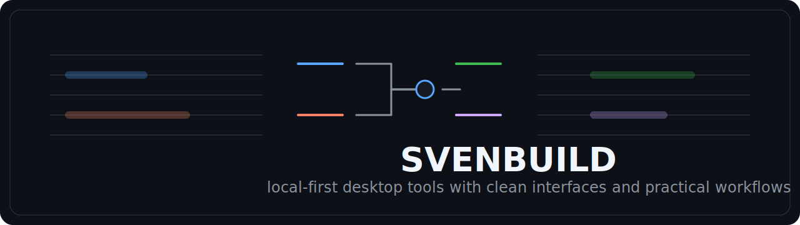
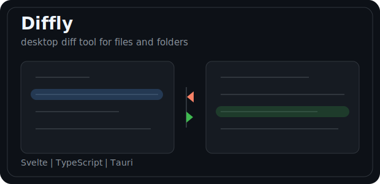
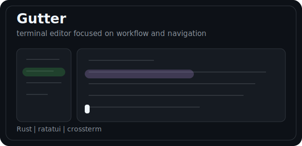
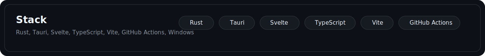

  

  <a href="https://github.com/svenbuild?tab=repositories">repositories</a>
  |
  <a href="https://github.com/svenbuild/diffly">diffly</a>
  |
  <a href="https://github.com/svenbuild/gutter">gutter</a>
  |
  <a href="https://github.com/svenbuild/svenbuild/blob/main/pages/skills.md">stack</a>
  |
  <a href="https://github.com/svenbuild/svenbuild/blob/main/pages/stats.md">notes</a>

<table>
  <tr>
    <td width="50%">
      
    </td>
    <td width="50%">
      
    </td>
  </tr>
</table>

  

