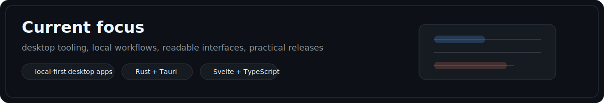

  

## Now

- building desktop tools instead of browser-first products
- focusing on local file workflows and readable interfaces
- keeping release flows practical and boring

## Repositories

- [Diffly](https://github.com/svenbuild/diffly)
- [Gutter](https://github.com/svenbuild/gutter)

GitHub already exposes the real contribution graph on the profile itself, so this page stays focused on what I am building rather than external stat widgets.

[Back to profile](https://github.com/svenbuild)
